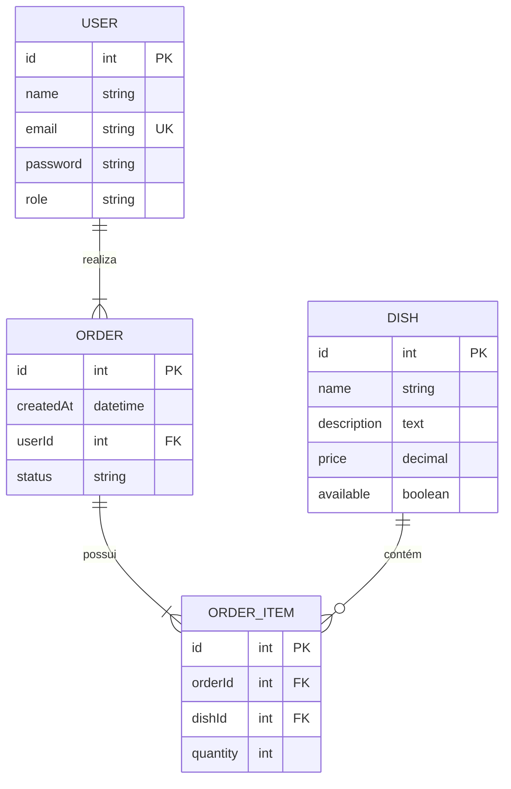
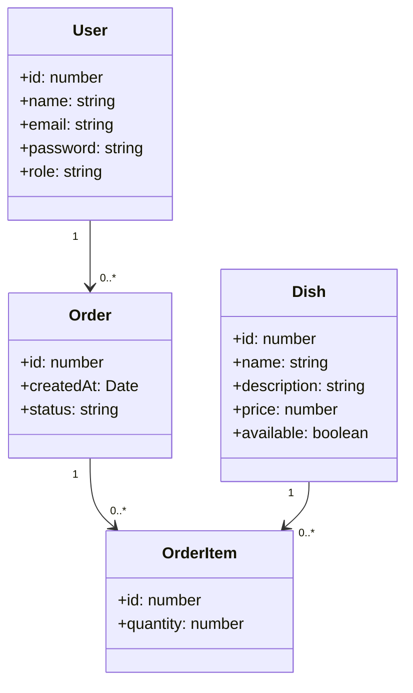

# 🍽️ Aula: Relacionamentos no TypeORM  

## 🎯 Objetivo da Aula  
Nesta aula, vamos aprender a utilizar **relacionamentos** no TypeORM para construir um banco de dados de um restaurante. Ao final, você será capaz de:  
  
✅ Criar relacionamentos **OneToMany**, **ManyToOne** e **ManyToMany**.  
✅ Construir um **banco de dados relacional** utilizando TypeORM.  

---  
## 🍕 Modelagem do Banco de Dados  

Vamos criar um **Sistema de Pedidos para um Restaurante**, onde teremos as seguintes entidades:  

- **Usuário (`User`)**: Clientes que fazem pedidos.  
- **Prato (`Dish`)**: Representa os pratos disponíveis no cardápio.  
- **Pedido (`Order`)**: Registro de um pedido feito por um usuário.  
- **Item do Pedido (`OrderItem`)**: Ligação entre um pedido e os pratos.  

### 📌 Modelo Entidade-Relacionamento (MER)  



### 🔧 Diagrama Entidade-Relacionamento (DER)  



---

## 🏗️ Implementando o Banco com TypeORM  

### 1️⃣ Configuração do Projeto  

Caso ainda não tenha um projeto TypeORM configurado, siga os passos abaixo:  

```bash
npm init -y
npm install express mysql2 typeorm reflect-metadata dotenv
npm install typescript ts-node-dev @types/node @types/express -D
```

Crie o arquivo `tsconfig.json`:  

```json
{
  "compilerOptions": {
    "target": "ES6",
    "module": "CommonJS",
    "outDir": "dist",
    "rootDir": "src",
    "strict": true,
    "esModuleInterop": true,
    "experimentalDecorators": true,
    "emitDecoratorMetadata": true,
  },
    "include": ["src/models/*.ts"],
    "exclude": ["node_modules"]
}
```

Adicione o script no `package.json`:  

```json
"scripts": {
  "dev": "ts-node-dev src/server.ts"
}
```

---

### 2️⃣ Configuração do Banco de Dados  

Crie um arquivo `.env`:  

```env
DB_HOST=localhost
DB_PORT=3306
DB_USER=root
DB_PASSWORD=root
DB_NAME=restaurante
```

Configure o **TypeORM** no `src/data-source.ts`:  

```ts
import "reflect-metadata";
import { DataSource } from "typeorm";
import dotenv from "dotenv";

dotenv.config();

export const AppDataSource = new DataSource({
  type: "mysql",
  host: process.env.DB_HOST,
  port: Number(process.env.DB_PORT),
  username: process.env.DB_USER,
  password: process.env.DB_PASSWORD,
  database: process.env.DB_NAME,
  entities: ["src/models/*.ts"],
  synchronize: true,
  logging: false,
});
```

---

### 3️⃣ Criando as Entidades  

#### 🧑 Usuário (`User`)  

```ts
import { Entity, PrimaryGeneratedColumn, Column, OneToMany } from "typeorm";
import { Order } from "./Order";

@Entity('users')
export class User {

  @PrimaryGeneratedColumn()
  id: number;

  @Column({ length: 100, nullable: false })
  name: string;

  @Column({ unique: true })
  email: string;

  @Column({ nullable: false })
  password: string;

  @Column({ default: "customer" })
  role: string;

  @OneToMany(() => Order, (order) => order.user)
  orders: Order[];
}
```

---

#### 📦 Pedido (`Order`)  

```ts
import { Entity, PrimaryGeneratedColumn, Column, ManyToOne, OneToMany } from "typeorm";
import { User } from "./User";
import { OrderItem } from "./OrderItem";

@Entity('orders')
export class Order {

  @PrimaryGeneratedColumn()
  id: number;

  @Column({ type: "timestamp", default: () => "CURRENT_TIMESTAMP" })
  createdAt: Date;

  @Column({ default: "pending" })
  status: string;

  @ManyToOne(() => User, (user) => user.orders)
  user: User;

  @OneToMany(() => OrderItem, (orderItem) => orderItem.order)
  items: OrderItem[];
}
```

---

#### 🍽️ Prato (`Dish`)  

```ts
import { Entity, PrimaryGeneratedColumn, Column, OneToMany } from "typeorm";
import { OrderItem } from "./OrderItem";

@Entity('dishes')
export class Dish {

  @PrimaryGeneratedColumn()
  id: number;

  @Column({ length: 150 })
  name: string;

  @Column("text")
  description: string;

  @Column({ type: "decimal", precision: 6, scale: 2 })
  price: number;

  @Column({ default: true })
  available: boolean;

  @OneToMany(() => OrderItem, (orderItem) => orderItem.dish)
  orderItems: OrderItem[];
}
```

---

#### 🍽️ Item do Pedido (`OrderItem`)  

```ts
import { Entity, PrimaryGeneratedColumn, Column, ManyToOne } from "typeorm";
import { Order } from "./Order";
import { Dish } from "./Dish";

@Entity('orderItems')
export class OrderItem {

  @PrimaryGeneratedColumn()
  id: number;

  @Column()
  quantity: number;

  @ManyToOne(() => Order, (order) => order.items)
  order: Order;

  @ManyToOne(() => Dish, (dish) => dish.orderItems)
  dish: Dish;
}
```

## 🚀 Exercícios  

1️⃣ **Adicione um campo** `phone` na entidade `User`, garantindo que seja **único** e tenha no máximo 15 caracteres.  
2️⃣ **Crie uma relação ManyToMany** entre `User` e `Dish`, para armazenar pratos favoritos de um usuário.  
3️⃣ **Crie uma API REST** para manipular pedidos (`Order`) e seus itens (`OrderItem`).  
